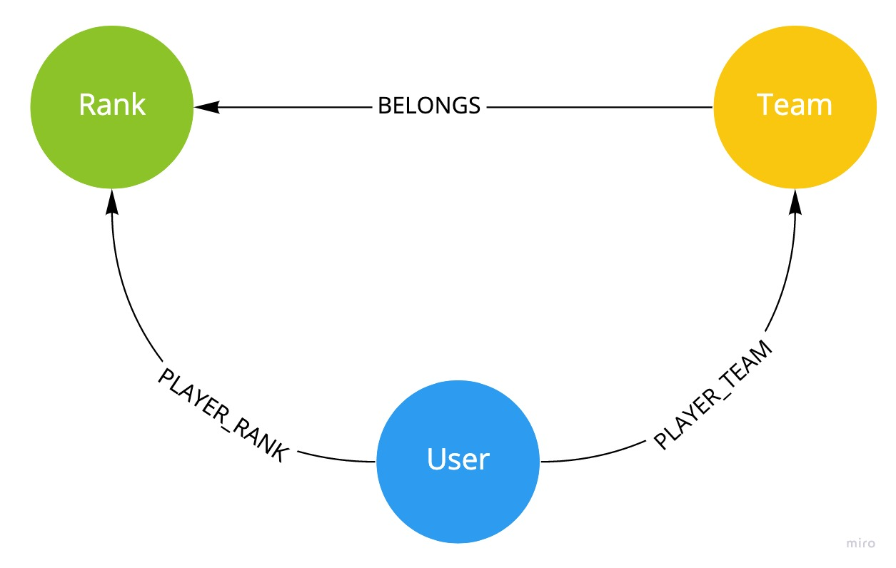

# fiap-engage
Database Solution Sprint

## Modelagem do banco gráfico


## Modelagem E/R
Existe um modelo conceitual construído dentro do diretório `documentation` construído pelo Oracle Developer.

## Metadados
Belongs
```json
{
  "createdDate": "datetime",
  "from": "Team",
  "score": "int",
  "to": "Rank",
  "updatedDate": "datetime"
}
```

Player Rank
```json
{
  "createdDate": "datetime",
  "from": "User",
  "score": "int",
  "to": "Rank",
  "updatedDate": "datetime"
}
```

Player Team
```json
{
  "createdDate": "datetime",
  "from": "User",
  "score": "int",
  "to": "Team",
  "updatedDate": "datetime"
}
```

Rank
```json
{
  "createdDate": "datetime",
  "id": "int",
  "image": "string",
  "name": "string",
  "updatedDate": "datetime"
}
```

Team
```json
{
  "createdDate": "datetime",
  "id": "int",
  "image": "string".
  "name": "string",
  "updatedDate": "datetime"
}
```

User
```json
{
  "createdDate": "datetime",
  "id": "int",
  "image": "string",
  "name": "string",
  "updatedDate": "datetime"
}
```

## Arquitetura proposta


## Cypher
Rank dos times
```cypher
MATCH (r:Rank) WHERE r.id = 0
MATCH (r)<-[p:BELONGS]-(t:Team)
RETURN t.id, t.name, t.image, p.score
ORDER BY p.score ASC
LIMIT 10
```

Rank dos usuários de um determinado time
```cypher
MATCH (t:Team) WHERE t.id = 0
MATCH (t)<-[p:PLAYER_TEAM]-(u:User)
RETURN u.id, u.name, u.image, p.score
ORDER BY p.score ASC
LIMIT 10
```

Rank geral dos usuários
```cypher
MATCH (r:Rank) WHERE r.id = 0
MATCH (r)<-[p:PLAYER_RANK]-(u:User)
RETURN u.id, u.name, u.image, p.score
ORDER BY p.score ASC
LIMIT 10
```

## GraphQL
Rank dos times
```graphql
{
  Rank(id: $rankId) {
    id
    name
    image
    teams(first: 10, orderBy: score_desc) {
      score
      Team {
        id
        name
        image
      }
    }
  }
}
```

Rank dos usuários de um determinado time
```graphql
{
  Team(id: $teamId) {
    id
    name
    image
    users(first: 10, orderBy: score_desc) {
      score
      User {
        id
        name
        image
      }
    }
  }
}
```

Rank geral dos usuários
```graphql
{
  Rank(id: $rankId) {
    id
    name
    image
    users(first: 10, orderBy: score_desc) {
      score
      User {
        id
        name
        image
      }
    }
  }
}
```
